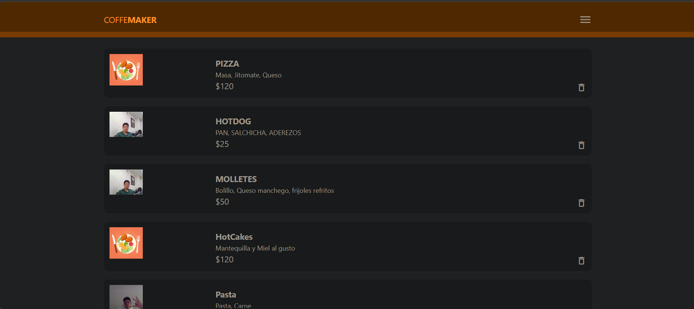

# COFFE MAKER

Aplicación web progresiva (PWA) desarrollada para facilitar la consulta de platillos y el registro de pedidos de una cafetería.

**Tipo de aplicación:** Progressive Web App (PWA)

**Materia:** PROGRAMACION AVANSADA

**Carrera:** Ingeniería en Sistemas Computacionales

**Alumno:** Jonathan Alejandro Castro De Zamacona

**Institución:** Universidad Multicultural CUDEC

**Grupo:** 09ISC182

---

# 1. Título del proyecto

## COFFE MAKER

Coffe Maker es una aplicación web progresiva (PWA) diseñada para facilitar la consulta de platillos, sus precios y el registro de pedidos de manera rápida, sencilla y accesible desde diferentes dispositivos.

La aplicación permite a los usuarios consultar el menú, registrar platillos, realizar pedidos y obtener un código QR asociado al pedido realizado.

---

# 2. Descripción del proyecto

Coffe Maker surge como una solución para facilitar el proceso de consulta y registro de pedidos dentro de una cafetería.

La aplicación permite administrar y consultar los platillos disponibles, registrar nuevos platillos y realizar pedidos proporcionando información del cliente y su dirección.

Además, el sistema utiliza geolocalización para obtener la ubicación del usuario y mostrarla mediante un mapa interactivo. Después de registrar un pedido, la aplicación genera un código QR único que contiene información relacionada con el pedido.

### Usuarios

La aplicación está dirigida principalmente a:

* Clientes de la cafetería.
* Personal encargado de registrar platillos.
* Personal encargado de gestionar pedidos.

### Propósito

El propósito principal de Coffe Maker es proporcionar una plataforma sencilla y accesible para digitalizar parte del proceso de consulta y registro de pedidos de una cafetería.

---

# 3. Objetivos

## Objetivo general

Desarrollar una aplicación web progresiva que permita consultar platillos, registrar productos y realizar pedidos de manera rápida, sencilla y accesible, utilizando tecnologías web y servicios en la nube.

## Objetivos específicos

* Diseñar una interfaz web sencilla e intuitiva.
* Implementar una aplicación con características de PWA.
* Permitir la consulta de platillos disponibles.
* Permitir el registro de nuevos platillos.
* Permitir a los usuarios realizar pedidos.
* Almacenar la información de los pedidos en Firebase Firestore.
* Implementar geolocalización para obtener la ubicación del usuario.
* Mostrar la ubicación mediante un mapa interactivo.
* Generar un código QR único después de registrar un pedido.
* Facilitar la consulta de la información relacionada con el pedido mediante el código QR.
* Implementar un menú de navegación lateral para facilitar el acceso a las diferentes secciones de la aplicación.

---

# 4. Características principales

La aplicación cuenta con las siguientes funcionalidades:

* Página de inicio.
* Visualización de platillos disponibles.
* Registro de nuevos platillos.
* Consulta del nombre y costo de los platillos.
* Registro de pedidos.
* Selección de platillos mediante un menú desplegable.
* Registro del nombre del cliente.
* Registro de dirección.
* Obtención de ubicación mediante geolocalización.
* Visualización de la ubicación mediante un mapa.
* Uso de OpenStreetMap mediante Leaflet.
* Almacenamiento de información mediante Firebase Firestore.
* Generación de un código único para cada pedido.
* Generación automática de código QR después de registrar un pedido.
* Código QR escaneable desde dispositivos móviles.
* Menú lateral de navegación.
* Página "Acerca de".
* Página de contacto.
* Diseño adaptable a diferentes tamaños de pantalla.
* Características de aplicación web progresiva (PWA).

---

# 5. Tecnologías utilizadas

## Lenguajes

* HTML
* CSS
* JavaScript

## Frameworks y librerías

### Materialize CSS

Utilizado para el diseño de la interfaz, componentes visuales, formularios, menú lateral y elementos responsivos.

### Firebase

Utilizado como plataforma para almacenar y administrar la información de la aplicación.

### Firebase Firestore

Base de datos NoSQL utilizada para almacenar los platillos y pedidos.

### Leaflet

Utilizado para mostrar mapas interactivos y la ubicación del usuario.

**Versión:** 1.9.4

### OpenStreetMap

Fuente de los mapas utilizados mediante Leaflet.

### QRCode.js

Utilizado para generar códigos QR automáticamente después de registrar un pedido.

**Versión:** 1.0.0

## PWA

La aplicación incorpora características de Progressive Web App mediante:

* `manifest.json`
* Service Worker
* Iconos para diferentes tamaños de dispositivos.
* Configuración para instalación como aplicación.
* Adaptación para dispositivos móviles.

---

# 6. Estructura del proyecto

La estructura principal del proyecto es la siguiente:

```text
COFFEMAKER/
│
├── index.html
├── manifest.json
├── sw.js
│
├── css/
│   ├── materialize.min.css
│   └── styles.css
│
├── js/
│   ├── materialize.min.js
│   ├── firebase.js
│   ├── index.js
│   ├── db.js
│   └── pedidos.js
│
├── pages/
│   ├── about.html
│   ├── pedidos.html
│   └── contact.html
│
├── img/
│   ├── ACERCA 1.png
│   ├── ACERCA 2.png
│   ├── CONTACTO 1.png
│   ├── CONTACTO 2.png
│   ├── INICIO.png
│   ├── NUEVO PLATILLO.png
│   ├── PEDIDO 1.png
│   ├── PEDIDO 2.png
│   └── platillo.png
│
└── README.md
```

---

# 7. Evidencias

A continuación se muestran las evidencias de las diferentes funcionalidades y páginas de la aplicación Coffe Maker.

## 7.1 Página de inicio



La página de inicio muestra la interfaz principal de la aplicación y permite acceder a las diferentes funciones mediante el menú de navegación.

## 7.2 Visualización de platillos


En esta sección se muestran los platillos disponibles, incluyendo información relacionada con el nombre, precio e imagen del producto.

## 7.3 Registro de un nuevo platillo


Esta sección permite registrar nuevos platillos proporcionando la información correspondiente del producto.

## 7.4 Registro de pedido


En esta pantalla se puede realizar el registro de un nuevo pedido, proporcionando los datos solicitados por la aplicación.

## 7.5 Pedido registrado y código QR


Después de registrar un pedido, la aplicación genera la información correspondiente y un código QR asociado al pedido.

## 7.6 Página Acerca de


La página "Acerca de" proporciona información relacionada con la aplicación Coffe Maker y su propósito.

## 7.7 Información adicional de Acerca de


Esta sección muestra información adicional relacionada con las características y funcionamiento de la aplicación.

## 7.8 Página de contacto


La página de contacto permite al usuario consultar la información disponible para establecer comunicación.

## 7.9 Formulario de contacto


En esta sección se presenta el formulario o información necesaria para establecer contacto con los responsables de la aplicación.

---

# 8. Base de datos

## Motor utilizado

La aplicación utiliza **Firebase Firestore** como sistema de almacenamiento de datos. Firestore es una base de datos NoSQL en la nube que permite almacenar y consultar la información de los platillos y pedidos de la aplicación.

## Colecciones utilizadas

### 1. PLATILLOS

La colección `PLATILLOS` almacena la información de los platillos disponibles en Coffe Maker.

Los principales datos almacenados son:

* **nombre:** Nombre del platillo.
* **costo:** Precio del platillo.
* **ingredientes:** Ingredientes que contiene el platillo.
* **imagen:** Información relacionada con la imagen del platillo.

### 2. PEDIDOS

La colección `PEDIDOS` almacena los pedidos realizados por los usuarios.

Los principales datos almacenados son:

* **platillo:** Identificador del platillo seleccionado.
* **nombre:** Nombre del cliente que realiza el pedido.
* **direccion:** Dirección proporcionada para el pedido.
* **fecha:** Fecha y hora en la que se registra el pedido.

Cada pedido cuenta además con un **identificador único generado automáticamente por Firebase Firestore**, el cual es utilizado por la aplicación para generar el código QR del pedido.

## Estructura general

```text
Firestore
│
├── PLATILLOS
│   ├── nombre
│   ├── costo
│   ├── ingredientes
│   └── imagen
│
└── PEDIDOS
    ├── platillo
    ├── nombre
    ├── direccion
    └── fecha
```

---

# 9. Licencia

Este proyecto fue desarrollado exclusivamente con **fines académicos** como parte de la carrera de **Ingeniería en Sistemas Computacionales** en la **Universidad Multicultural CUDEC**.

## Licencia MIT

Se utiliza la **Licencia MIT**, permitiendo el uso, copia, modificación y distribución del código del proyecto, siempre que se conserve el aviso de copyright y la licencia correspondiente.

```text
MIT License

Copyright (c) 2026 Jonathan Alejandro Castro De Zamacona

Permission is hereby granted, free of charge, to any person obtaining a copy
of this software and associated documentation files, to deal in the Software
without restriction, including without limitation the rights to use, copy,
modify, merge, publish, distribute, sublicense, and/or sell copies of the
Software, and to permit persons to whom the Software is furnished to do so,
subject to the following conditions:

The above copyright notice and this permission notice shall be included in
all copies or substantial portions of the Software.

THE SOFTWARE IS PROVIDED "AS IS", WITHOUT WARRANTY OF ANY KIND, EXPRESS OR
IMPLIED, INCLUDING BUT NOT LIMITED TO THE WARRANTIES OF MERCHANTABILITY,
FITNESS FOR A PARTICULAR PURPOSE AND NONINFRINGEMENT. IN NO EVENT SHALL THE
AUTHORS OR COPYRIGHT HOLDERS BE LIABLE FOR ANY CLAIM, DAMAGES OR OTHER
LIABILITY, WHETHER IN AN ACTION OF CONTRACT, TORT OR OTHERWISE, ARISING FROM,
OUT OF OR IN CONNECTION WITH THE SOFTWARE OR THE USE OR OTHER DEALINGS IN
THE SOFTWARE.
```

**Autor:** Jonathan Alejandro Castro De Zamacona

**Carrera:** Ingeniería en Sistemas Computacionales

**Institución:** Universidad Multicultural CUDEC

**Año:** 2026
